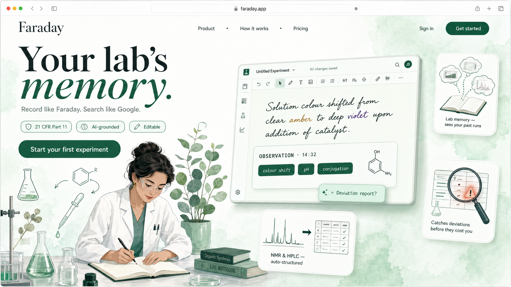
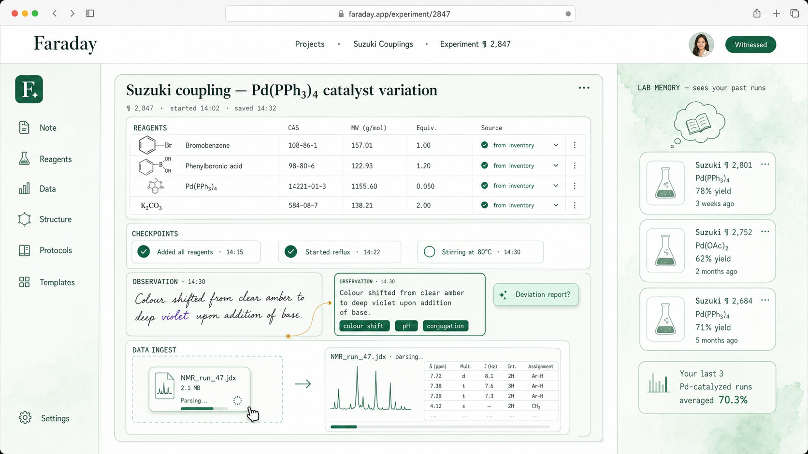
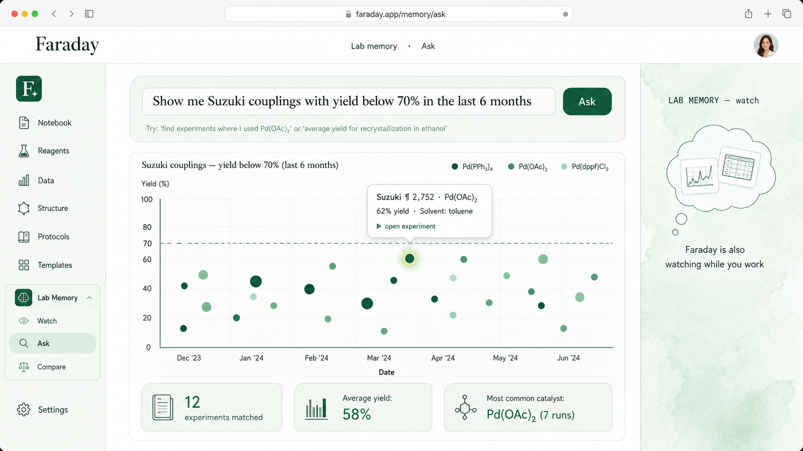
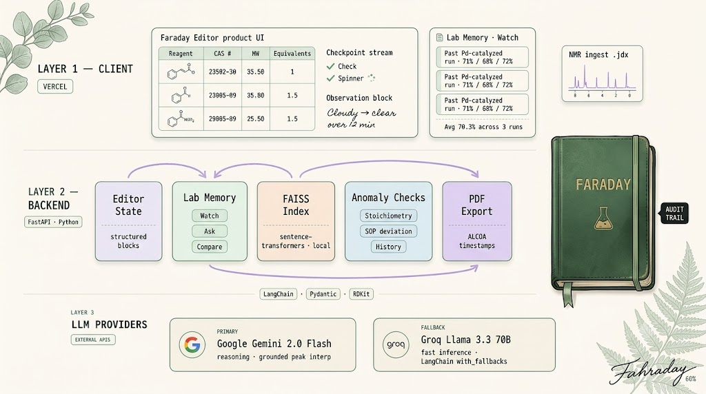

# Faraday

> *Record like Faraday. Search like Google. Your lab's memory.*

**AI-assisted lab notebook for industry chemists** in pharma, biotech, and materials R&D. Collapses the documentation-vs-doing tradeoff that forces regulated labs to pay for ELN compliance and still keep paper notebooks open at the bench.

Named after Michael Faraday — who wrote ~30,000 numbered paragraphs of lab journals across four decades. Patron saint of rigorous documentation.

---

## Status

**v0.1 Lab Memory Ask mode · shipped · live**

| | Link |
|---|---|
| Frontend | https://faraday-eta.vercel.app |
| Backend | https://coding-chemist-faraday.hf.space |
| Try a query | https://faraday-eta.vercel.app/memory/ask |

Spec locked 2026-06-13. Build slice 1 (Lab Memory Ask mode) executed in a single session and deployed end-to-end on 2026-06-16. Three illustration-grade screen mockups are in [`assets/`](./assets); full functional spec is in [`docs/spec.md`](./docs/spec.md).

**What works end-to-end:**

- Natural-language query → structured `QuerySpec` via `gpt-oss:20b` on Ollama Cloud (custom markdown-fence-strip retry loop on top of `instructor` + Pydantic)
- Pandas filter + aggregate keyed by `ChartType` enum (factory + decorator registry, no `if/elif` chains)
- Six chart types rendered via Recharts: scatter, timeseries, bar, list, histogram, heatmap
- 210 realistic seeded experiments across five reaction types (Suzuki coupling / Buchwald-Hartwig / amide coupling / reductive amination / carbonyl reduction), frequency-weighted per Roughley & Jordan medchem literature analysis
- Glassmorphism matched-experiments table with top-5 pagination, search, status filters
- Heatmap with frozen X/Y axes (Excel-style 2D pane)
- Marketing landing with a live Ask-preview hero card (real components, not a mockup)

**Stack:** FastAPI · Celery · Redis · SQLite · FAISS · Vite · React · MUI · Tailwind · Recharts · Ollama Cloud (`gpt-oss:20b`) · Docker on HF Spaces · Vercel

---

## The wedge

Existing ELNs (Benchling, LabArchives, Dotmatics, IDBS, Signals, RSpace) are expensive, form-heavy, and bad at search. Many chemists in regulated labs pay for ELN compliance **and still use paper** — because paper is faster at the bench and the search problem in their ELN is unsolved anyway.

Faraday's wedge is collapsing that tradeoff with three primitives no ELN ships today:

| Primitive | What it does | Why it matters |
|---|---|---|
| **Lab Memory** | Three-mode recall across all past experiments — *Watch* (proactive sidebar while you write), *Ask* (natural language → visual chart), *Compare* (structured side-by-side diff) | The actual problem regulated labs have isn't recording — it's finding the run from 8 months ago that worked. ELNs are write-only in practice. |
| **Anomaly catches** | Stoichiometry checks, SOP-deviation flags, history comparison against your own past yields — all in the editor as you type | The chemist sees the deviation when they can still react to it, not in a post-hoc audit |
| **Instrument-native ingest** | NMR (`.jdx`, `.csv`) and HPLC (`.csv`) auto-structured into the notebook with real peak tables, not screenshots | Instrument data lives where the experiment lives. Audit trail is automatic. |

---

## Screens

### Landing

Chemist at the bench. Fresh-green palette with soft watercolor backdrop — explicitly **not** the cream warmth of editorial illustrations. Three feature vignettes orbiting the editor preview, deep-forest CTA.

### Editor

Suzuki coupling experiment in progress — full reagent table with molecule thumbnails, CAS numbers, MW, equivalents. Three checkpoints (two done, one in progress). Cursive observation auto-structured. NMR data ingest with real peak table. Lab Memory Watch sidebar surfaces three past Pd-catalyzed runs averaging 70.3% yield — proactively, not when asked.

### Lab Memory · Ask mode

Natural-language query: *"Show Suzuki couplings where yield was below 70% in the last six months, colored by catalyst."* Scatter plot rendered, prominent callout on the worst outlier, three summary cards (12 matched, 58% avg, Pd(OAc)₂ most common). This is the differentiator. **Faraday isn't a chatbot. It's your lab's memory.**

---

## Architecture (v0.1)

**Zero agents in v0.1.** Each feature is a stateless RAG call or structured LLM call. Justification: agentic complexity adds latency and reduces predictability without value at v0.1 scope. Agents return in v0.2 (Publication Mode) and v0.3 (Smart Audit) where they earn their latency.

Same stack as [Curie](https://github.com/coding-chemist/Curie) — RAG primitive proven, ALCOA/21 CFR Part 11 awareness baked in, instrument data ingest from cheminformatics background.

---

## v0.1 scope

| Area | Status |
|---|---|
| Lab Memory · Ask mode | **Shipped** — NL → QuerySpec → pandas aggregate → 6 chart types · live |
| Editor (block-based) | Coming v0.2 — spec locked, mockup in [`assets/editor.png`](./assets/editor.png) |
| Reagent setup (type-ahead, CAS, barcode, inventory, custom) | Coming v0.2 |
| Live recording + checkpoints | Coming v0.2 |
| Instrument ingest — NMR (`.jdx`, `.csv`) + HPLC (`.csv`) | Coming v0.2 |
| Lab Memory · Watch mode (proactive sidebar) | Coming v0.2 |
| Lab Memory · Compare mode (structured diff) | Coming v0.2 |
| Anomaly detection (stoichiometry · SOP · history) | Coming v0.2 |
| Calculations (yield · equivalents · thermodynamics · kinetics) | Coming v0.2 |
| Output — editable report + PDF export | Coming v0.2 |
| Audit trail — ALCOA timestamps + immutable history + witness | Coming v0.2 |
| Auth | None — single-user demo |

---

## Design language

Two completely separate visual registers — locked through 6+ iterations on 2026-06-13:

| Register | Where it lives | Palette |
|---|---|---|
| **Product UI** | Landing, editor, Lab Memory screens | Fresh greens — sage `#8FB89A`, mint `#C9E4D2`, forest `#2D6A4F`. Pale powder-white base `#F7FAF6`. Modern, restrained. |
| **Editorial illustration** | Architecture diagrams, README heroes, marketing | Cream `#FAF8F3`, naturalist botanical, warm amber. Curie/Darwin's established palette. |

Mixing the two produces *"magazine cover for a SaaS product"* — wrong on both axes. Faraday is product UI, not editorial.

---

## Why this is a portfolio piece, not vaporware

Three things distinguish a design repo from an empty repo:

1. **Domain depth in the spec.** Real reagent metadata, real NMR file formats, real ALCOA/21 CFR Part 11 awareness, real instrument data structures. The kind of detail that comes from chemistry MSc + cheminformatics years, not from skimming Wikipedia.
2. **Restraint as a design choice.** Zero agents in v0.1 isn't a limitation — it's a stated architectural decision with a written justification. Agents return in v0.2 (Publication Mode) and v0.3 (Smart Audit) where they earn their latency.
3. **Visual identity that ships first.** Three illustration-grade screen mockups locked before line one of code. Design language separated from editorial illustration with a written rule. The repo reads as something Benchling should have built.

---

## See also

- [Curie](https://github.com/coding-chemist/Curie) — Citation-backed RAG for NMR structure elucidation. Faraday's analytical sibling.
- [Darwin](https://github.com/coding-chemist/Darwin) — AI-augmented interview platform. Same architectural restraint, different domain.

---

## Author

**Sindhuja Sivaraman** · MSc Chemistry · MS Data Science → Senior Engineer, AI/ML — HTC Global Services
[Portfolio](https://coding-chemist.vercel.app) · [GitHub](https://github.com/coding-chemist)

> *Record like Faraday. Search like Google. The work deserves better than a paper notebook.*
